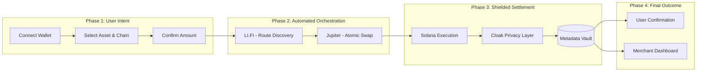

<p align="center">
  
</p>

<h1 align="center">StreamPay</h1>

<p align="center">
  <b>Private, cross-chain payment infrastructure powered by Solana</b>
</p>

<p align="center">
  <a href="https://streampay-web.vercel.app">🌐 Live App</a> •
  <a href="https://www.npmjs.com/package/streampay-sdk">📦 npm SDK</a> •
  <a href="#">🎥 Demo Video (Coming Soon)</a> •
  <a href="#">📊 Pitch Deck (Coming Soon)</a>
</p>

<p align="center">
  Built by <b>Rohan Kumar</b> • Team <b>BROTHERHOOD</b>
</p>

<p align="center">
  
  
  
</p>

## Overview

StreamPay isn't just another payment gateway; it's the missing link between the sovereign freedom of decentralized finance and the non-negotiable privacy of global commerce. We've built the infrastructure that finally allows businesses to scale on-chain without stripping away their competitive confidentiality.

### The Problem
Traditional crypto payments suffer from a fundamental paradox: they offer borderless efficiency but demand total transparency. 
*   **The Exposure Trap:** In a world where every transaction is public, payroll becomes a security risk, vendor relationships become open secrets, and business strategy is laid bare for competitors to see.
*   **The Fragmentation Wall:** Cross-chain liquidity is trapped in silos. Forcing a user to bridge, swap, and sign multiple times to make a simple payment is the antithesis of a professional user experience.
*   **The Infrastructure Void:** Most "solutions" are either fully transparent or too complex for real-world accounting. Merchants are left choosing between privacy and usability.

### The Solution: Our Discovery
We realized that privacy doesn't require complex zero-knowledge proofs for every single micro-interaction. Instead, we pioneered **Metadata Abstraction**.
*   **Decoupled Execution:** By separating the raw on-chain settlement from the sensitive payment intent, we achieve "private-like" confidentiality. The chain sees a successful transfer; only the parties involved see the *why*, the *who*, and the *context*.
*   **Seamless Cross-Chain Settlement:** We've unified the multi-chain landscape. Users pay with what they have; merchants receive what they need. No manual bridging, no friction—just pure, high-velocity commerce.
*   **Professional Standard:** We are moving blockchain payments from a "public novelty" to a "professional financial standard," giving businesses the tools to operate at scale with confidence.

---

## How It Works: User Workflow

We've engineered a high-orchestration pipeline that turns a complex multi-chain journey into a single, elegant interaction for the user:



1.  **Connect & Select:** The user connects their wallet (e.g., Phantom, Metamask) and selects any asset on any supported chain (Ethereum, Base, Solana, etc.).
2.  **Intelligent Discovery:** Our integration with **LI.FI** instantly discovers the most cost-effective and secure path across the ecosystem for the specific payment amount.
3.  **One-Click Authorization:** The user signs a single transaction. StreamPay handles the bridge, the swap via **Jupiter**, and the final payment settlement automatically.
4.  **Shielded Settlement:** The payment is finalized on Solana. To any observer, it's just another fast transaction; the sensitive details are shielded from the public ledger.
5.  **Metadata Vaulting:** While the transaction settles, the rich data—invoice IDs and purpose—is securely vaulted off-chain, ensuring private accounting.
6.  **Real-Time Confirmation:** The merchant and user both receive instant confirmation. The merchant dashboard updates with the full "Single Source of Truth."

---


## Features

*   **🔐 Privacy Abstraction Layer:** Our core innovation that decouples sensitive metadata from public on-chain execution.
*   **🌉 Cross-Chain Payments:** Seamlessly accept assets from any EVM or non-EVM chain via **LI.FI** routing.
*   **⚡ Fast Swaps via Jupiter:** Instant, low-slippage conversion into your target settlement asset.
*   **💼 Merchant Dashboard:** A professional-grade console for tracking revenue, managing plans, and monitoring private subscriptions.
*   **🔗 Wallet-Based Payments:** Full support for industry-standard wallets like **Phantom** and Metamask.
*   **📡 Webhook Support:** Real-time event notifications to sync your backend with every private payment.
*   **🧾 Subscription Tracking:** Advanced logic for managing recurring billing cycles without exposing customer data.
*   **🧠 Developer SDK Integration:** A developer-first approach with our **[streampay-sdk](https://www.npmjs.com/package/streampay-sdk)** (100+ downloads), allowing for seamless integration of private payments into any application.

---

## Hackathon Tracks Implemented

StreamPay is a multi-disciplinary powerhouse, intentionally designed to span the most critical tracks in the Solana ecosystem. We have applied for **7 strategic tracks**, each representing a core pillar of our infrastructure.

### **1. Cloak: Privacy-Focused Payment Abstraction**
Cloak is the heart of our privacy promise. By utilizing Cloak's abstraction layer, we ensure that while the settlement is verified on the blockchain, the *intent* and *identity* behind the payment remain shielded. This allows businesses to operate with the same confidentiality they expect from traditional banking, but with the sovereign power of Solana.

### **2. RPC Fast: High-Octane Transaction Execution**
Speed is a feature, not an afterthought. We utilize **RPC Fast** as our primary gateway to the Solana network. This ensures that our cross-chain swaps and shielded settlements are broadcast and confirmed with sub-second latency. Without RPC Fast's enterprise-grade reliability, the seamless "One-Click" experience of StreamPay wouldn't be possible.

### **3. MagicBlock: Private Execution Layer Concept**
We've integrated **MagicBlock** concepts to handle complex execution states in a private manner. This allows us to manage subscription logic and payment verification without leaking state information to public explorers, further hardening the privacy of our merchant-customer relationships.

### **4. Dune: On-Chain Data and Analytics**
Data-driven decisions shouldn't require compromising privacy. We leverage **Dune** to provide aggregate, non-sensitive insights into the health of the StreamPay ecosystem. This gives merchants the macro-level data they need—revenue trends, active user counts, and growth metrics—while our metadata layer protects the micro-level privacy.

### **5. LI.FI: The Cross-Chain Routing Backbone**
**LI.FI** is the bridge that brings the entire multi-chain world to StreamPay. By integrating their route discovery and bridging infrastructure, we've made it possible for a user on Ethereum or Base to pay a StreamPay merchant on Solana as easily as if they were on the same chain. It is the foundation of our "Pay with Anything" philosophy.

### **6. Jupiter: Swap Aggregation & Liquidity**
The final mile of every StreamPay transaction is handled by **Jupiter**. Their swap aggregation ensures that regardless of what asset the user sends, the merchant receives their settled funds with the best possible price and minimal slippage. Jupiter is the engine that makes our unified Solana settlement both viable and highly efficient.

### **7. Dodo Payments: Public Fallback & Global Reach**
For users and regions where traditional blockchain transparency is required or preferred, we've integrated **Dodo Payments**. This provides a robust public fallback path, ensuring that StreamPay remains a globally accessible platform that can accommodate any regulatory or personal preference without friction.

---

---

## Architecture

StreamPay is engineered as a high-fidelity payment orchestration ecosystem. Our architecture is designed to handle the entire lifecycle of a transaction—from multi-chain intake and liquidity routing to shielded settlement and automated merchant reporting.


### Technical Component Breakdown

*   **Intake & Orchestration:** A unified entry point for both our native web app and third-party integrations via the **StreamPay SDK**. It leverages **LI.FI** for intelligent route discovery and **Jupiter** for atomic, zero-slippage swaps into the settlement currency.
*   **On-Chain Execution (Solana):** Our dual-program architecture—**Payment Router** and **Subscription Manager**—manages the complex state of recurring billing and one-time payments. All interactions are routed through **RPC Fast** to guarantee enterprise-grade performance and sub-second finality.
*   **The Privacy Engine:** Powered by the **Cloak SDK**, this layer executes shielded transactions that decouple the public ledger from sensitive payment details. We support **Selective Auditability** through viewing keys, allowing merchants to remain compliant while keeping their data private.
*   **Persistence & Persistence:** The **Metadata Vault** is our secure off-chain layer that bridges the gap between raw blockchain hashes and human-readable business data. 
*   **The Merchant Ecosystem:** A full-stack suite including a **Next.js Console**, **Dune Analytics** for aggregate insights, and a robust **Webhook Engine** that triggers external merchant services (ERP, CRM, etc.) upon payment confirmation.

---

## StreamPay SDK

StreamPay is a developer-first platform. Our **[streampay-sdk](https://www.npmjs.com/package/streampay-sdk)** (100+ downloads) allows you to integrate privacy-first, cross-chain payments into your application with just a few lines of code.

### 🌟 Features
- **🔐 Privacy by Default** - All payments protected by Cloak's privacy layer.
- **⚡ Optimized Execution** - MagicBlock integration for faster, cheaper transactions.
- **💰 Multi-Currency Support** - USDC, USDT, and native SOL payments.
- **🔄 Automatic Retries** - Built-in exponential backoff for resilience.
- **📊 Type-Safe** - Full TypeScript support with strict types.

### 🚀 Quick Start

**Installation**
```bash
npm install streampay-sdk
```

**Basic Usage**
```typescript
import { StreamPay } from "streampay-sdk";

// Initialize SDK with your API key
const sdk = new StreamPay({
  apiKey: "sp_live_abc123...",
});

// Create a private payment
const payment = await sdk.payments.create({
  amount: 1000, // $10.00 in cents
  currency: "USDC",
  recipient_id: "7qLn8gQUJfaRFMx2HaJe5aAMYm7MgKgsCp7PVKgBvfXY",
  privacy_mode: "cloak",
  source_chain: "solana",
});

console.log(`Payment created: ${payment.id}`);
console.log(`Status: ${payment.status}`);
```

### 🔄 Subscriptions API
Manage recurring billing with flexible intervals while maintaining customer privacy.

```typescript
const subscription = await sdk.subscriptions.create({
  amount: 2999, // $29.99 per month
  currency: "USDC",
  interval: "monthly",
  recipient_id: "user_wallet",
  privacy_mode: "cloak",
});
```

**[Full SDK Documentation →](https://www.npmjs.com/package/streampay-sdk)**

---

## Contract Deployments (Devnet)

### Payment Router
The StreamPay Payment Router contract is live on Solana Devnet. It records payment intents and confirms execution via execution references from our privacy layers.
- **Program ID**: `Bs464Nm3DY6qNafJn5kmVHxh9R8nKRLpuXfdDrZQMd76`
- **Deployment Signature**: `5QV3WoHgcumYgH5brQpBKBdNcfAoeZt2XCofdrJG8y65JxEX8rdhpzGhGeY1usT1eDefzdp4kmpfk1iv5smFfJHy`
- **Status**: ✅ Finalized
- **Verification**: [View on Solana Explorer](https://explorer.solana.com/tx/5QV3WoHgcumYgH5brQpBKBdNcfAoeZt2XCofdrJG8y65JxEX8rdhpzGhGeY1usT1eDefzdp4kmpfk1iv5smFfJHy?cluster=devnet)

**Core Functions:**
- Records `PaymentRecord` accounts with `Pending` status.
- Confirms execution and updates records to `Completed`.
- Supports flexible authorization for user, merchant, or backend authorities.

### Subscription Manager
The Subscription Manager handles the lifecycle of recurring payments, from plan creation to renewal.
- **Program ID**: `Bs464Nm3DY6qNafJn5kmVHxh9R8nKRLpuXfdDrZQMd76`
- **Upgrade Signature**: `TzkUpt83SxkEYky7Nz97kKoNaWExTrEW1FTjjksJhmGFhNQbHk2SW2xRH9gk71k84ZekF64cenFibWHJhxSSype`
- **Status**: ✅ Finalized
- **Verification**: [View on Solana Explorer](https://explorer.solana.com/tx/TzkUpt83SxkEYky7Nz97kKoNaWExTrEW1FTjjksJhmGFhNQbHk2SW2xRH9gk71k84ZekF64cenFibWHJhxSSype?cluster=devnet)

**Core Functions:**
- Merchant registration of subscription plans (amount, duration).
- Activation of user subscriptions linked to payment records.
- Automatic status tracking (Active, Paused, Expired).

---

## Tech Stack

StreamPay is built using a modern, high-performance stack designed for the next generation of financial applications.

*   **Frontend:** Next.js, Tailwind CSS
*   **Blockchain Logic:** Solana Web3.js, Wallet Adapter (Phantom)
*   **Infrastructure:** **RPC Fast** (Primary Node Provider)
*   **Cross-Chain Routing:** **LI.FI API**
*   **Liquidity & Swaps:** **Jupiter API**
*   **Backend:** Node.js (API Routes)
*   **Data Persistence:** PostgreSQL (Secure Metadata Storage)
*   **Privacy Layer:** **Cloak SDK** & **MagicBlock** concepts

---

## Live Demo

**🌐 [Launch StreamPay Web App](https://streampay-web.vercel.app)**

### How to use:
1.  **Connect Wallet:** Link your Phantom or Metamask wallet.
2.  **Private Pay:** Select a plan and click "Private Pay" to initiate the shielded workflow.
3.  **Verify:** Compare the generic transfer hash on the Solana Explorer with the rich, itemized data available in your StreamPay Merchant Dashboard.

---

## Interface Preview

*Experience the seamless, privacy-first interface of StreamPay.*


---

## Demo Flow: The Privacy Difference

Our demo illustrates the stark contrast between public exposure and professional privacy:

*   **On-Chain (Public):** Observers only see a standard token transfer and a transaction hash. No recipient identity, no invoice details, no business context.
*   **Off-Chain (Private):** The full, itemized transaction details are securely stored in our metadata layer.
*   **Merchant Dashboard:** The merchant sees the complete "Single Source of Truth"—who paid, for what, and when—without leaking that data to the public ledger.

---

## Monetization

StreamPay is designed as a sustainable protocol with multiple revenue streams:

*   **Transaction Fees:** A small percentage fee on every cross-chain or shielded payment.
*   **SaaS Dashboard:** Tiered subscription models for advanced merchant analytics and CRM tools.
*   **Developer API:** Usage-based pricing for high-volume enterprise integrations via our SDK.
*   **Premium Privacy:** Enhanced shielding features and selective auditability tools for regulated industries.

---

## Future Scope

We are just getting started. Our roadmap focuses on hardening privacy and expanding cross-chain utility:

*   **Cryptographic Privacy:** Transitioning from metadata abstraction to full cryptographic shielding using ZK-proofs or shielded transaction pools.
*   **Direct Cross-Chain Execution:** Moving beyond simulation to native, protocol-level cross-chain contract calls.
*   **Enterprise ERP Integrations:** Seamless plugins for SAP, Oracle, and QuickBooks.
*   **Compliance Suite:** Advanced viewing key management for automated tax reporting and regulatory compliance.

---


## Builder

**Rohan Kumar**
*   **GitHub:** [rohan911438](https://github.com/rohan911438)
*   **Team:** **BROTHERHOOD**

---
